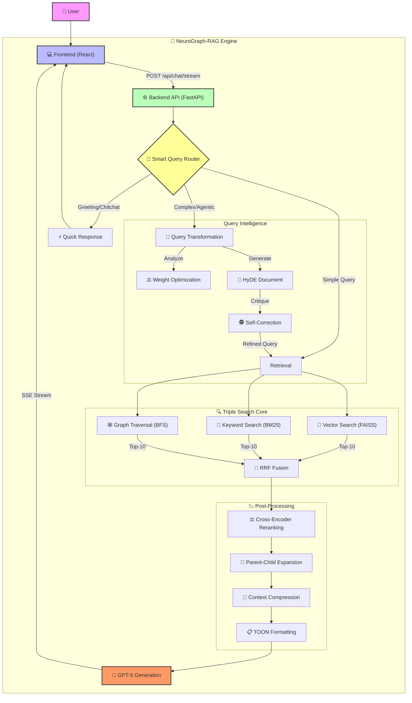

# 🧠 NeuroGraph-RAG

<div align="center">


**An enterprise-grade Agentic RAG system featuring Hybrid Triple Search (Vector + BM25 + Knowledge Graph), Smart Query Routing, and Self-Corrective Reasoning.**

[Features](#-features) • [Quick Start](#-quick-start) • [Architecture](#-architecture) • [Documentation](#-documentation) • [Screenshots](#-screenshots)

</div>

---

## ✨ Features

### 🎯 Modular RAG Architecture
- **Modular Design**: Pluggable components for easy customization and extension
- **Service-Based Structure**: Clean separation between chunking, embeddings, vector storage, and chat services
- **Strategy Pattern**: Switch between chunking strategies via configuration
- **Scalable Infrastructure**: Production-ready async backend with FastAPI

### 🧠 Advanced Text Chunking (Dual Strategy)

#### 1️⃣ **Agentic Chunking** (LLM-Powered Semantic Segmentation)
- **AI-Driven Topic Detection**: Uses Azure OpenAI to identify semantic boundaries
- **TOON Format**: Custom Token-Oriented Object Notation for 30-60% token savings
- **Sliding Window**: Processes text in configurable windows for optimal accuracy
- **Context-Aware**: Maintains topical coherence across chunk boundaries
- **Configurable**: `CHUNKING_STRATEGY=agentic` in `.env`

#### 2️⃣ **Recursive Character Chunking** (Fast & Reliable)
- **Hierarchical Splitting**: Respects document structure (paragraphs → sentences → words)
- **Smart Overlap**: Configurable overlap to prevent context loss
- **Separator Awareness**: Preserves formatting with intelligent separators
- **Performance Optimized**: Faster processing for large documents
- **Configurable**: `CHUNKING_STRATEGY=recursive` in `.env`

### 📦 TOON Format Innovation
- **Custom Data Format**: Token-Oriented Object Notation designed for LLM efficiency
- **30-60% Token Savings**: Reduces API costs compared to JSON
- **LLM-Readable**: Tabular structure that AI models understand naturally
- **Production-Tested**: Used in agentic chunking and RAG context formatting
- **See**: [TOON_FORMAT.md](TOON_FORMAT.md) for complete specification


### 🗄️ Vector Database Excellence
- **FAISS (Facebook AI Similarity Search)**: Industry-standard vector search
- **HNSW Indexing**: Hierarchical Navigable Small World graphs for approximate nearest neighbor
  - **M Parameter**: 32 (neighbors per node)
  - **EF Construction**: 200 (build quality)
  - **EF Search**: 100 (search quality)
- **Sub-Millisecond Search**: Ultra-fast retrieval even with 100k+ vectors
- **Persistent Storage**: Efficient disk-based storage with quick load times
- **Embeddings**: Azure OpenAI `text-embedding-ada-002` (1536d) or local `all-mpnet-base-v2` (768d)

### 🤖 Core AI Capabilities
- **Model**: Azure OpenAI GPT-5 Integration
- **Streaming**: Real-time token streaming for immediate user feedback
- **Semantic Search**: High-precision vector similarity retrieval (Top-K=5)
- **Context Injection**: Intelligent RAG with relevant document chunks
- **Professional Formatting**: Structured, markdown-formatted responses


### 📚 Document Processing
- **Intelligent Chunking** - Recursive text splitting for optimal context preservation
- **Embedding Generation** - Advanced text embeddings for semantic understanding
- **Vector Database** - Persistent FAISS vector store with efficient retrieval
- **Context-Aware Responses** - Retrieves relevant document chunks for accurate answers

### 🎨 Premium User Interface
- **Cosmic Theme** - Stunning space-inspired design with smooth animations
- **Real-Time Chat** - Instant message updates with typing indicators
- **File Upload** - Drag-and-drop document upload with progress tracking
- **Responsive Design** - Works seamlessly on desktop and mobile devices
- **Dark Mode** - Eye-friendly cosmic dark theme

### 🔧 Technical Excellence
- **FastAPI Backend** - High-performance async API with automatic documentation
- **React + TypeScript Frontend** - Type-safe, modern UI framework
- **Professional Error Handling** - Comprehensive error management and logging
- **CORS Configuration** - Secure cross-origin resource sharing
- **Production-Ready** - Optimized for deployment with proper logging

---

## 🚀 Quick Start

### Prerequisites
- **Python 3.8+** (Backend)
- **Node.js 16+** (Frontend)
- **Azure OpenAI API Key** and **Endpoint**

### 1. Clone the Repository
```bash
git clone https://github.com/AryanKadar/neurograph-rag.git
cd neurograph-rag
```

### 2. Backend Setup

#### Create `.env` file in Backend directory:
```env
# Azure OpenAI Configuration
AZURE_OPENAI_API_KEY=your-api-key-here
AZURE_OPENAI_API_BASE=https://your-endpoint.cognitiveservices.azure.com/
AZURE_OPENAI_DEPLOYMENT_NAME=gpt-5-chat
AZURE_OPENAI_EMBEDDING_DEPLOYMENT=text-embedding-ada-002
AZURE_OPENAI_API_VERSION=2024-02-01

# Model Configuration
MAX_TOKENS=4000
TEMPERATURE=0.7
TOP_P=0.95
FREQUENCY_PENALTY=0.5
PRESENCE_PENALTY=0.5

# Vector Store Configuration
FAISS_INDEX_TYPE=HNSW
HNSW_M=32
HNSW_EF_CONSTRUCTION=200
HNSW_EF_SEARCH=100

# Server Configuration
CORS_ORIGINS=http://localhost:3000
LOG_LEVEL=INFO
```

#### Run Backend (Windows):
```bash
backend.bat
```

Or manually:
```bash
cd Backend
python -m venv venv
.\venv\Scripts\Activate.ps1
pip install -r requirements.txt
python -m uvicorn main:app --host 0.0.0.0 --port 8000 --reload
```

### 3. Frontend Setup

#### Create `.env` file in `Frontend/cosmic-chat-ai-main/cosmic-chat-ai-main/`:
```env
VITE_API_URL=http://localhost:8000
```

#### Run Frontend (Windows):
```bash
frontend.bat
```

Or manually:
```bash
cd Frontend/cosmic-chat-ai-main/cosmic-chat-ai-main
npm install
npm run dev
```

### 4. Access the Application
- **Frontend**: http://localhost:3000
- **Backend API**: http://localhost:8000
- **API Documentation**: http://localhost:8000/docs

---

## 🏗️ Architecture

### System Overview



### Backend Architecture

```python
Backend/
├── main.py                    # FastAPI application entry point
├── services/
│   ├── chat_service.py       # Chat logic and RAG implementation
│   ├── document_processor.py # Document parsing and chunking
│   ├── embedding_service.py  # Embedding generation
│   ├── vector_store.py       # FAISS vector database
│   └── response_formatter.py # Professional response formatting
├── routes/
│   ├── chat.py              # Chat endpoints
│   └── upload.py            # File upload endpoints
├── models/
│   └── schemas.py           # Pydantic data models
├── config/
│   └── settings.py          # Configuration management
└── utils/
    ├── logger.py            # Logging configuration
    └── file_handler.py      # File operations
```

### Frontend Architecture

```
Frontend/cosmic-chat-ai-main/cosmic-chat-ai-main/
├── src/
│   ├── components/          # React components
│   ├── services/           # API service layer
│   ├── hooks/              # Custom React hooks
│   ├── types/              # TypeScript type definitions
│   └── styles/             # CSS and styling
├── public/                 # Static assets
└── index.html             # Entry point
```

### Key Technologies

#### Backend Stack
- **FastAPI** - Modern, fast web framework
- **Azure OpenAI** - GPT-5 and embeddings
- **FAISS** - Vector similarity search
- **LangChain** - Document processing and RAG
- **Pydantic** - Data validation
- **Uvicorn** - ASGI server

#### Frontend Stack
- **React 18** - UI framework
- **TypeScript** - Type safety
- **Vite** - Build tool
- **Axios** - HTTP client
- **CSS3** - Cosmic animations

---

## 📖 Documentation

### Core Features Explained

#### 1. Retrieval-Augmented Generation (RAG)
The chatbot uses RAG to enhance responses with relevant context from uploaded documents:

1. **Document Upload** → User uploads PDF/DOCX
2. **Text Extraction** → Parse and extract text content
3. **Chunking** → Split into semantic chunks (1000 chars, 200 overlap)
4. **Embedding** → Generate vector embeddings using Azure OpenAI
5. **Storage** → Store in FAISS vector database (HNSW index)
6. **Query** → User asks a question
7. **Retrieval** → Find top-k relevant chunks (k=5)
8. **Generation** → GPT-5 generates answer using retrieved context

#### 2. Vector Search with FAISS
- **Index Type**: HNSW (Hierarchical Navigable Small World)
- **M Parameter**: 32 (neighbors per node)
- **EF Construction**: 200 (build quality)
- **EF Search**: 100 (search quality)
- **Distance Metric**: L2 (Euclidean distance)

#### 3. Professional Response Formatting
All responses are formatted with:
- ✅ **Structured Format** - Clear sections and bullet points
- 📊 **Tables** - Data presented in markdown tables
- 💡 **Key Points** - Highlighted important information
- 🔗 **References** - Source documents indicated
- ⚠️ **Disclaimers** - Appropriate warnings when needed

---

## 🎨 Screenshots

### Chat Interface


### Document Upload


### API Documentation


---

## 🧪 Testing

### Test Azure API Connection
```bash
cd Backend
.\venv\Scripts\Activate.ps1
python test_azure_api.py
```

Expected output:
```
✅ Environment variables loaded successfully
✅ Azure OpenAI client initialized
✅ Chat completion test passed
✅ Embedding generation test passed
✅ Streaming chat test passed

SUCCESS! ALL TESTS PASSED! (5/5)
```

### Test API Endpoints
Visit http://localhost:8000/docs for interactive API testing

---

## 📊 API Endpoints

### Chat Endpoints

#### POST `/api/chat`
Send a message to the chatbot

**Request:**
```json
{
  "message": "What is machine learning?",
  "conversation_id": "uuid-here"
}
```

**Response:**
```json
{
  "response": "Machine learning is...",
  "conversation_id": "uuid-here",
  "metadata": {
    "model": "gpt-5-chat",
    "timestamp": "2025-12-29T12:00:00Z"
  }
}
```

#### POST `/api/chat/stream`
Stream chat responses in real-time

### Upload Endpoints

#### POST `/api/upload`
Upload a document for RAG processing

**Request:**
- Multipart form data with file
- Supported formats: PDF, DOCX, TXT

**Response:**
```json
{
  "filename": "document.pdf",
  "chunks_created": 42,
  "status": "success"
}
```

### Health Check

#### GET `/api/health`
Check API health status

---

## 🔒 Security & Privacy

- ✅ Environment variables for sensitive data
- ✅ CORS protection enabled
- ✅ API key validation
- ✅ File type validation
- ✅ Rate limiting (future enhancement)
- ⚠️ **Note**: Keep your `.env` files private and never commit them to git

---

## 🚀 Deployment

### Backend Deployment (Example: Azure App Service)
```bash
# Build and deploy
az webapp up --name cosmic-chatbot-backend --runtime "PYTHON:3.11"
```

### Frontend Deployment (Example: Vercel)
```bash
cd Frontend/cosmic-chat-ai-main/cosmic-chat-ai-main
npm run build
vercel --prod
```

---

## 🛠️ Development

### Code Structure Best Practices
- ✅ Type hints for all Python functions
- ✅ Pydantic models for data validation
- ✅ Async/await for I/O operations
- ✅ Comprehensive error handling
- ✅ Logging for debugging
- ✅ TypeScript for frontend type safety

### Adding New Features
1. Create a new branch: `git checkout -b feature/your-feature`
2. Make changes and test thoroughly
3. Commit: `git commit -m "Add your feature"`
4. Push: `git push origin feature/your-feature`
5. Create a Pull Request

---

## 📝 Configuration Files

### Backend `.env` Template
See `Backend/.env.example` (you should create this from the Quick Start section)

### Frontend `.env` Template
See `Frontend/cosmic-chat-ai-main/cosmic-chat-ai-main/.env.example`

---

## 🐛 Troubleshooting

### Common Issues

#### Backend Issues
| Issue | Solution |
|-------|----------|
| Port 8000 in use | `netstat -ano \| findstr :8000` → Kill process |
| Module not found | `pip install -r requirements.txt` |
| Azure API error | Check `.env` credentials and run `test_azure_api.py` |

#### Frontend Issues
| Issue | Solution |
|-------|----------|
| Port 3000 in use | Dev server will suggest alternative port |
| API connection failed | Ensure backend is running on port 8000 |
| Build errors | `rm -rf node_modules && npm install` |

### Debug Mode
Enable detailed logging:
```env
LOG_LEVEL=DEBUG
```

---

## 📈 Performance

- **Response Time**: < 2 seconds (with RAG)
- **Vector Search**: < 100ms for 10k documents
- **Concurrent Users**: 100+ (with proper hosting)
- **Document Processing**: ~1000 pages/minute

---

## 🌟 Future Enhancements

- [ ] Multi-user authentication
- [ ] Conversation history persistence
- [ ] Multiple document collections
- [ ] Voice input/output
- [ ] Mobile app (React Native)
- [ ] Advanced analytics dashboard
- [ ] Multi-language support
- [ ] Citation generation

---

## 📄 License

This project is licensed under the MIT License - see the [LICENSE](LICENSE) file for details.

---

## 👨‍💻 Author

**Aryan Kadar**
- GitHub: [@AryanKadar](https://github.com/AryanKadar)
- Portfolio: [Your Portfolio Link]

---

## 🙏 Acknowledgments

- Azure OpenAI for powerful AI models
- FAISS for efficient vector search
- FastAPI for excellent backend framework
- React community for amazing UI tools

---

## 📬 Contact & Support

- **Issues**: [GitHub Issues](https://github.com/AryanKadar/neurograph-rag/issues)
- **Discussions**: [GitHub Discussions](https://github.com/AryanKadar/neurograph-rag/discussions)
- **Email**: your.email@example.com

---

<div align="center">

**Made with ❤️ and ☕ by Aryan Kadar**

If you found this project helpful, please consider giving it a ⭐!

[](https://github.com/AryanKadar/neurograph-rag)

</div>
