# 🧠 NeuroGraph-RAG: Graph-Native Agentic Intelligence

<div align="center">


**The Ultimate Hybrid RAG System: Fusing Knowledge Graphs, Vector Search, and Agentic Reasoning.**

*Advanced Neo4j Integration • Self-Correcting Thoughts • Smart Query Routing • Agentic Chunking*

[Features](#-features) • [Architecture](#-architecture-diagram) • [Neo4j Implementation](#-neo4j-graph-implementation) • [Quick Start](#-quick-start) • [Docs](#-documentation)

</div>

---

## 🚀 Overview

**NeuroGraph-RAG** is a state-of-the-art **Graph-Native Agentic RAG** system designed to solve the limitations of traditional RAG. By integrating a **Neo4j Knowledge Graph** alongside Vector (FAISS) and Keyword (BM25) search, it achieves **deep context understanding** and **multi-hop reasoning** capabilities that flat vector stores cannot match.

Powered by **GPT-5** (via Azure OpenAI), it features a self-corrective cognitive loop, smart query routing, and a stunning "Cosmic" UI that provides real-time transparency into the AI's thought process.

---

## 🎨 Architecture Diagram

Below is the high-level architecture of the NeuroGraph Cognitive Engine.

```mermaid
graph TD
    %% Styling
    classDef user fill:#1a1b26,stroke:#7aa2f7,stroke-width:2px,color:#fff;
    classDef frontend fill:#24283b,stroke:#bb9af7,stroke-width:2px,color:#fff;
    classDef gateway fill:#414864,stroke:#7dcfff,stroke-width:2px,color:#fff;
    classDef ai fill:#24283b,stroke:#f7768e,stroke-width:2px,color:#fff,stroke-dasharray: 5 5;
    classDef core fill:#16161e,stroke:#9ece6a,stroke-width:2px,color:#fff;
    classDef storage fill:#1f2335,stroke:#e0af68,stroke-width:2px,color:#fff;
    classDef graphNode fill:#1f2335,stroke:#018bff,stroke-width:3px,color:#fff;
    
    User(👤 User) -->|Query| UI(💻 Cosmic UI)
    class User user
    class UI frontend
    
    UI -->|API Request| API(⚙️ FastAPI Backend)
    class API gateway
    
    subgraph "🧠 Cognitive Engine"
        API --> Router{🧭 Smart Router}
        class Router core
        
        Router -->|Simple/Greeting| Skip[⚡ Direct Answer]
        Router -->|Complex| Pipeline[🚀 Full RAG Pipeline]
        class Skip,Pipeline core
        
        subgraph "🔍 Retrieval Strategy"
            Pipeline --> HyDE[💡 HyDE Generator]
            class HyDE ai
            
            HyDE --> Triple{⚡ Triple Search}
            class Triple core
            
            Triple -->|Semantic| Vector[(📊 FAISS Vector Store)]
            Triple -->|Keyword| BM25[(📑 BM25 Index)]
            Triple -->|Relational| GraphDB[(🕸️ Neo4j Knowledge Graph)]
            
            class Vector,BM25 storage
            class GraphDB graphNode
        end
        
        subgraph "⚙️ Synthesis Layer"
            Vector & BM25 & GraphDB --> RRF[⚖️ RRF Fusion]
            class RRF core
            
            RRF --> Rerank[📉 Cross-Encoder Rerank]
            class Rerank core
            
            Rerank --> Context[📝 Context Window]
            class Context storage
            
            Context --> SelfCorrect{🛡️ Self-Correction}
            class SelfCorrect ai
            
            SelfCorrect -->|Confidence < Threshold| GraphDB
            SelfCorrect -->|Confidence High| LLM[🤖 GPT-5 Inference]
            class LLM ai
        end
    end
    
    Skip --> Response(💬 Streaming Response)
    LLM --> Response
    class Response frontend
    Response --> UI
```



---

## 🕸️ Neo4j Graph Implementation

Unlike standard RAG systems that treat documents as flat chunks, NeuroGraph-RAG understands the **connections** between ideas.

### **How It Works**
The system uses an **Agentic ETL Pipeline** to extract entities and relationships during document ingestion.

1.  **Nodes (Entities)**: Extracted concepts such as `Concepts`, `Technology`, `People`, `Locations`, `Events`.
2.  **Relationships (Edges)**: Semantic links connecting nodes, e.g., `(GPT-5)-[DEPENDS_ON]->(Transformer Architecture)`, `(Frontend)-[USES]->(React)`.
3.  **Graph Traversal**:
    *   **Agentic Extraction**: When a user queries "How does X affect Y?", the system actively traverses the graph path from Node X to Node Y.
    *   **Multi-Hop Reasoning**: Can answer questions requiring information from disparate parts of a document (or multiple documents) linked by a relationship chain.

### **Graph Schema**
*   **Document Nodes**: Represent original source files.
*   **Chunk Nodes**: Semantic text blocks.
*   **Entity Nodes**: Named entities detected by NLP.
*   **RELATIONSHIPS**: `CONTAINS`, `MENTIONS`, `RELATED_TO`, `CAUSES`, `DEPENDS_ON`.

> **Result**: The "Triple Search" (Vector + BM25 + Graph) provides significantly higher recall and accuracy for complex relational queries.

---

## ✨ Features

### 🧠 **Cognitive Intelligence**
*   **Hybrid Triple Search**: Combines the precision of Keyword Search (BM25), the understanding of Vector Search (FAISS), and the reasoning of Graph Search (Neo4j).
*   **Smart Query Routing**: Intelligently routes queries. Simple greetings skip the expensive RAG pipeline, saving time and cost.
*   **Self-Correction**: The AI critiques its own retrieved context. If confidence is low, it falls back to broader graph traversal.
*   **HyDE (Hypothetical Document Embeddings)**: Generates a hypothetical answer to improve retrieval for ambiguous queries.

### ⚡ **Performance & Architecture**
*   **Agentic Chunking**: Uses a dual-strategy (Semantic/Recursive) to split documents based on meaning, not just character count.
*   **TOON Format**: "Token-Oriented Object Notation" drastically reduces token usage (30-60% savings) compared to standard JSON.
*   **Asynchronous Core**: Fully async Python backend using FastAPI for high concurrency.
*   **Production Ready**: Includes strict typing (Pydantic), comprehensive logging, and error handling.

### 🎨 **Cosmic User Interface**
*   **Cybernetic Design**: A futuristic, dark-mode interface with glassmorphism and neon accents.
*   **Thought Process Visualization**: See exactly what the AI is doing—"Searching Graph...", "Reranking Results...", "Generating Answer".
*   **Real-Time Streaming**: Token-by-token streaming response (like ChatGPT).

---

## 🚀 Quick Start

### Prerequisites
*   **Python 3.10+** (Backend)
*   **Node.js 18+** (Frontend)
*   **Neo4j Database** (Desktop or AuraDB)
*   **Azure OpenAI Access** (GPT-4o/GPT-5)

### 1. Installation
Clone the repository:
```bash
git clone https://github.com/AryanKadar/neurograph-rag.git
cd neurograph-rag
```

### 2. Backend Setup
Navigate to the backend and install dependencies:
```bash
cd Backend
python -m venv venv
# Windows
.\venv\Scripts\activate
# Linux/Mac
source venv/bin/activate

pip install -r requirements.txt
```

Create a `.env` file in `Backend/` with your credentials:
```env
# Azure OpenAI
AZURE_OPENAI_API_KEY=your_key
AZURE_OPENAI_ENDPOINT=your_endpoint
AZURE_OPENAI_DEPLOYMENT_NAME=gpt-5-chat
AZURE_OPENAI_EMBEDDING_DEPLOYMENT=text-embedding-ada-002

# Neo4j Graph DB
NEO4J_URI=bolt://localhost:7687
NEO4J_USER=neo4j
NEO4J_PASSWORD=your_password

# System
CHUNKING_STRATEGY=agentic
```

Run the Backend:
```bash
# Windows
.\backend.bat
# Or manually: uvicorn main:app --reload
```

### 3. Frontend Setup
Navigate to the frontend directory:
```bash
cd Frontend/cosmic-chat-ai-main/cosmic-chat-ai-main
npm install
```

Create a `.env` file:
```env
VITE_API_URL=http://localhost:8000
```

Run the Frontend:
```bash
# Windows
..\..\frontend.bat
# Or manually: npm run dev
```

---

## 📚 Documentation

Detailed documentation is available in the repository:

*   [**System Walkthrough**](SYSTEM_WALKTHROUGH.md): A comprehensive deep-dive into the architecture with real-world examples.
*   [**Architecture Plan**](ARCHITECTURE.md): The original design specifications and architectural decisions. (Note: Kept for reference).

---

## 👨‍💻 Author

**Aryan Kadar**
*   GitHub: [@AryanKadar](https://github.com/AryanKadar)

---

<div align="center">

**[ Star this Repo ](https://github.com/AryanKadar/neurograph-rag)**

*Made with ❤️, ☕, and Graph Theory*

</div>
